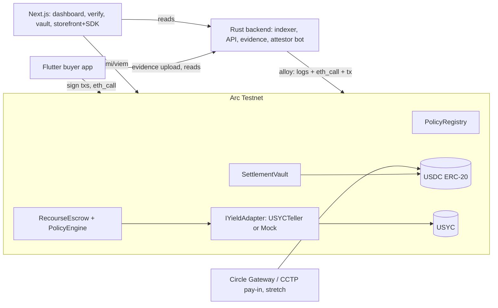

# Recourse: Architecture

## 0. System overview



Principles. Business logic lives onchain. The verdict engine has one canonical implementation (Solidity) and one mirror (TypeScript, for in-browser recompute). Rust and Dart never reimplement the engine; they eth_call it or read the API. The backend is a thin read layer plus blob store plus demo attestor. Everything downstream consumes addresses from one generated file.

## 1. Monorepo layout

```
recourse/
  contracts/            Foundry project (src, test, script)
  engine/               TS canonical mirror + policy compiler + verdict hash utils
  packages/vectors/     golden test vectors (JSON), consumed by forge AND vitest
  backend/              Rust: axum API, alloy indexer, sqlx models, attestor bot, seeder
  web/                  Next.js app (dashboard, verify, vault, storefront) + sdk/ package
  mobile/               Flutter buyer app
  deployments/          arc-testnet.json (single source of addresses) + codegen outputs
  ops/                  docker-compose (postgres), seed scripts, demo runbook
  log.md                append-only decisions, newest first
  handoff.md            rolling: blockers top, next actions, standing rules
```

## 2. Chain configuration

| Item | Value |
|---|---|
| Network | Arc Testnet |
| chainId | 5042002 |
| Gas token | USDC (native, 18 decimals at the protocol level) |
| USDC ERC-20 interface | 0x3600000000000000000000000000000000000000, 6 decimals |
| EURC ERC-20 | 0x89B50855Aa3bE2F677cD6303Cec089B5F319D72a (not used in MVP) |
| USYC | Via Teller contract after faucet/portal approval; addresses from docs.arc.io contract addresses page |
| RPC and explorer | Pull current endpoints from docs.arc.io; do not hardcode guessed URLs |
| Faucet | Circle faucet, select Arc Testnet, USDC (gas + payments) and EURC |

Hard rule: product logic reads and transfers USDC through the ERC-20 interface (6 decimals) only. Native balance (18 decimals) is for gas display at most. Mixing them corrupts every amount in the system.

## 3. Contracts (Foundry)

### 3.1 Shared types

```solidity
enum ClaimType { NotDelivered, Damaged, NotAsDescribed, WrongItem, Other } // uint8

// Evidence type bitmask
// 1 = PHOTO, 2 = DESCRIPTION, 4 = TRACKING_REF, 8 = VIDEO
// Attestation types: 0 = NONE, 1 = DELIVERY_STATUS
// DELIVERY_STATUS values: 0 = UNKNOWN, 1 = DELIVERED, 2 = NOT_DELIVERED

struct Rule {
    uint8  claimType;
    uint16 requiredEvidenceMask;
    uint8  attType;        // 0 none, 1 delivery_status
    uint8  attExpected;    // required attested value when attType != 0
    uint32 claimWindow;    // seconds from paidAt
    uint16 refundBps;
    bool   requiresReturn;
}

struct Policy {
    address merchant;
    uint32  disputeWindow;     // seconds
    uint16  defaultRefundBps;  // applied when no rule matches
    Rule[]  rules;             // max 16, evaluated in order, first match wins
}
```

### 3.2 PolicyRegistry.sol

```solidity
function registerPolicy(uint32 disputeWindow, uint16 defaultRefundBps, Rule[] calldata rules, string calldata metadataURI)
    external returns (uint256 policyId);
function getPolicy(uint256 policyId) external view returns (Policy memory);
function policyHash(uint256 policyId) external view returns (bytes32);
// policyHash = keccak256(abi.encode(merchant, disputeWindow, defaultRefundBps, rules))
// Policies are immutable. Edits register a new policyId. metadataURI points at the authored JSON (served by backend) for UI rendering.
event PolicyRegistered(uint256 indexed policyId, address indexed merchant, bytes32 policyHash, string metadataURI);
```

### 3.3 PolicyEngine.sol (library, the canonical engine)

```solidity
struct VerdictInput {
    uint8  claimType;
    uint16 evidenceMask;
    uint8  attType;
    uint8  attValue;
    uint64 paidAt;
    uint64 filedAt;
}
struct Verdict { uint16 refundBps; bool requiresReturn; uint8 ruleIndex; bool matched; } // ruleIndex = 255 when default applies

function compute(Policy memory p, VerdictInput memory i) internal pure returns (Verdict memory);
function verdictHash(bytes32 policyHash, uint256 paymentId, VerdictInput memory i, Verdict memory v) internal pure returns (bytes32);
// verdictHash = keccak256(abi.encode(policyHash, paymentId, i, v))
```

Pure, no storage, no block context beyond the passed timestamps. This is the function the TS mirror replicates bit for bit.

### 3.4 RecourseEscrow.sol

```solidity
enum Status { None, Paid, Disputed, Resolved, Settled }

struct Payment {
    address buyer;          // refundTo, fixed at pay time
    address merchant;
    address beneficiary;    // merchant, or vault after assignment
    uint256 policyId;
    uint128 amount;         // USDC, 6 decimals
    uint128 shares;         // yield adapter shares
    uint64  paidAt;
    uint64  filedAt;
    uint8   claimType;
    uint16  evidenceMask;
    uint8   attType;
    uint8   attValue;       // 0 until attested
    bytes32 evidenceRoot;   // keccak256 of packed (evType, hash) tuples
    uint16  verdictBps;
    Status  status;
}

function pay(uint256 policyId, uint128 amount, bytes32 orderRef) external returns (uint256 paymentId);
// transferFrom buyer, deposit into adapter, store shares, status Paid
// emit Paid(paymentId, buyer, merchant, policyId, amount, orderRef, policyHash)

function fileDispute(uint256 paymentId, uint8 claimType, EvidenceItem[] calldata evidence) external;
// only buyer, only while Paid, only within disputeWindow; derives evidenceMask, stores evidenceRoot; emit DisputeFiled

function submitAttestation(uint256 paymentId, uint8 attType, uint8 value, uint64 deadline, bytes calldata sig) external;
// EIP-712, signer must be ATTESTOR role; stores attValue; emit Attested

function resolve(uint256 paymentId) external;
// only while Disputed; require attestation present OR filedAt + resolveDelay elapsed (resolveDelay is a constructor param, 60s for demo)
// verdict = PolicyEngine.compute(...); redeem shares -> total (principal + yield)
// buyer receives amount * refundBps / 10000
// beneficiary receives remainder + yield share; protocol treasury takes yieldFeeBps of yield
// status Settled; emit Resolved(paymentId, verdict fields, verdictHash)

function release(uint256 paymentId) external;
// only while Paid and past disputeWindow; redeem; pay beneficiary + yield split; status Settled; emit Released

function assign(uint256 paymentId, address newBeneficiary) external;
// only current beneficiary; used by the vault after advancing the merchant; emit Assigned

function previewVerdict(uint256 paymentId) external view returns (Verdict memory, bytes32 verdictHash);
// public view for the verify page, Rust, and Flutter; the eth_call surface
```

Reentrancy guards on all fund-moving functions. Pull-style accounting is unnecessary because transfers are USDC push at settle, but keep nonReentrant everywhere anyway.

### 3.5 SettlementVault.sol

```solidity
// USDC share vault, ERC-4626-shaped but minimal
function deposit(uint256 assets) external returns (uint256 sharesMinted);
function withdraw(uint256 shares) external returns (uint256 assetsOut);
function enrollMerchant(address merchant, uint16 feeBps, uint128 exposureCap) external; // owner, demo governance
function advance(uint256 paymentId) external;
// requires merchant enrolled, escrow beneficiary == merchant, exposure under cap
// pays merchant amount - fee, books outstanding at par, calls escrow.assign(paymentId, address(this))
function reconcile(uint256 paymentId) external;
// requires escrow Settled and beneficiary == vault; decrement outstanding by par, realized PnL flows to share price
function totalAssets() public view returns (uint256); // idle USDC + outstanding at par
```

Simplification to state in the deck honestly: outstanding claims are carried at par until settled; losses realize at reconcile. Flat 50 bps fee for MVP; risk-based pricing from onchain dispute history is roadmap.

### 3.6 Yield adapters

```solidity
interface IYieldAdapter {
    function deposit(uint256 assets) external returns (uint256 shares);
    function redeem(uint256 shares) external returns (uint256 assets);
    function previewRedeem(uint256 shares) external view returns (uint256);
}
```

MockUSYCAdapter: holds USDC, internal exchange rate accrues continuously at roughly 4.5 percent APY from deploy, deterministic per block timestamp. USYCTellerAdapter: wraps the real testnet Teller buy/sell behind the same interface, gated on access approval. The escrow takes the adapter address at construction; swapping is a redeploy, which is fine on testnet.

### 3.7 Attestation EIP-712

Domain: name "RecourseAttestor", version "1", chainId 5042002, verifyingContract = escrow. Struct: Attestation { uint256 paymentId; uint8 attType; uint8 value; uint64 deadline }. Single ATTESTOR address for MVP, held by the backend bot, framed in the deck as any delivery oracle (carrier API, Chainlink) in production.

## 4. Engine parity discipline (the determinism spine)

One canonical engine (Solidity PolicyEngine.compute). One mirror (engine/ in TypeScript, exact same semantics, used by the verify page and the policy builder preview). One shared vector file: packages/vectors/verdicts.json. Format:

```json
{
  "name": "damaged-with-photo-within-window",
  "policy": { "merchant": "0x...", "disputeWindow": 1209600, "defaultRefundBps": 0, "rules": [ { "claimType": 1, "requiredEvidenceMask": 1, "attType": 0, "attExpected": 0, "claimWindow": 259200, "refundBps": 10000, "requiresReturn": true } ] },
  "input": { "claimType": 1, "evidenceMask": 3, "attType": 0, "attValue": 0, "paidAt": 1000, "filedAt": 5000 },
  "expect": { "refundBps": 10000, "requiresReturn": true, "ruleIndex": 0, "matched": true }
}
```

CI gates: forge test loads vectors via stdJson and asserts PolicyEngine output; vitest loads the same file and asserts the TS engine. Any engine change ships with updated vectors and both suites green in the same commit. Rust and Flutter consume verdicts exclusively through escrow.previewVerdict (eth_call) or the API. There is no third or fourth implementation, ever.

## 5. Backend (Rust)

Crates: axum, tokio, sqlx (postgres), alloy (provider, contract bindings, EIP-712 signing), serde, tower-http (cors), tracing, anyhow. Postgres via ops/docker-compose. Evidence blobs on local disk at data/evidence/<keccak256>, hash stored in DB, hash submitted onchain.

Indexer: poll eth_getLogs every second from a persisted cursor (sub-second finality makes simple polling correct; no reorg handling needed beyond a 1-block lag). Decodes PolicyRegistered, Paid, DisputeFiled, Attested, Resolved, Released, Assigned, vault Deposit/Withdraw/Advance/Reconcile into tables.

Tables: cursor, policies (id, merchant, hash, metadata_json), payments (all Payment fields + tx hashes + timestamps), evidence (payment_id, ev_type, hash, blob_path, uploaded_at), attestations, settlements, merchants (addr, enrolled, fee_bps, volume, dispute_count), vault_snapshots (tvl, outstanding, realized_pnl, ts).

Routes:

| Route | Purpose |
|---|---|
| GET /api/payments?merchant=&buyer=&status= | Lists for dashboard and app |
| GET /api/payments/:id | Joined detail: evidence, attestation, verdict |
| POST /api/evidence (multipart) | Store blob, return { evType, hash } |
| GET /api/evidence/:hash | Serve blob (dispute console, verify page) |
| GET /api/policies/:id | Decoded human-readable policy JSON |
| GET /api/merchants/:addr/stats | Volume, dispute rate, enrollment |
| GET /api/vault/stats | TVL, outstanding, APY decomposition |
| POST /api/demo/attest { paymentId, value } | DEMO_MODE only: bot signs EIP-712 and submits attestation tx |
| POST /api/demo/seed | DEMO_MODE only: runs the seeder |

The attestor bot and seeder are binaries in the same crate. Every demo route is gated behind DEMO_MODE=true and labeled in code as demo-only.

## 6. Web (Next.js)

App Router, wagmi v2 + viem, Tailwind. Pages: / (thin landing), /dashboard (merchant home: payments, T+0 payouts, yield), /dashboard/policies/new (builder form -> policy JSON -> compiler -> registerPolicy tx, with live TS-engine preview of sample disputes), /dashboard/disputes (list + evidence viewer), /vault (LP deposit/withdraw + APY decomposition), /store (demo storefront using the SDK), /verify/[paymentId] (public: fetch payment + policy via viem, run TS engine locally, eth_call previewVerdict, render both verdict hashes with a match check, plus a sandbox to flip inputs and watch the verdict recompute).

web/sdk: a tiny package exporting RecourseCheckout (React) and buildPaymentRequest(). Publishing to npm is optional polish; existing as a package in the repo is enough for the pitch.

## 7. Mobile (Flutter, buyer only)

Packages: web3dart (Arc is standard EVM via Reth, legacy and 1559 txs both fine), flutter_secure_storage (local key), flutter_riverpod, mobile_scanner (QR), image_picker (camera evidence), dio (API), qr_flutter (receipts).

Screens: Onboarding (generate or import key, store securely, show address + faucet pointer), Scan, Checkout Review (policy card rendered from /api/policies/:id, amount, merchant), Pay (approve + pay; two txs is fine for MVP), Receipts (list from /api/payments?buyer=), Receipt Detail (status timeline, escrow yield ticker via previewRedeem, dispute button inside window), File Dispute (claim type picker, camera capture, description; upload blobs to /api/evidence, collect hashes, sign fileDispute), Verdict (stamp treatment, refundBps, rule id, "verify on web" link to /verify/[paymentId]).

Payment request payload (QR and recourse:// deep link), JSON then base64url:

```json
{ "v": 1, "chainId": 5042002, "escrow": "0x...", "policyId": 3, "merchant": "0x...", "amount": "25000000", "orderRef": "0x..." }
```

Amounts always strings in 6-decimal base units.

## 8. Addresses and codegen

deployments/arc-testnet.json is written by the Foundry deploy script and is the only source of truth. A codegen script (ops/) emits: engine/src/addresses.ts, backend/src/addresses.rs, mobile/lib/addresses.dart. Nothing hardcodes an address. Ever.

## 9. Environments

| Var | Where | Notes |
|---|---|---|
| ARC_RPC_URL | all | From docs.arc.io |
| DEPLOYER_PK, ATTESTOR_PK, SEED_BUYER_PK, SEED_MERCHANT_PK | contracts, backend, ops | Testnet-only throwaways, never reused elsewhere |
| DATABASE_URL | backend | Postgres from docker-compose |
| DEMO_MODE | backend | Gates demo routes |
| NEXT_PUBLIC_API_URL, NEXT_PUBLIC_RPC | web | |
| API_URL, RPC_URL | mobile (dart-define) | |

## 10. Security posture (hackathon-grade, stated honestly)

Testnet only, unaudited, single attestor, owner-gated vault enrollment, no upgradeability, nonReentrant on all fund movers, checks-effects-interactions, exposure caps on advances, 16-rule policy bound, resolveDelay guard so attestation-dependent rules cannot be resolved prematurely. The deck lists exactly these as "what production hardening looks like," which reads as maturity, not weakness.

## 11. Build order (dependency-true)

1. contracts: types, PolicyEngine, vectors passing in forge
2. engine: TS mirror + compiler, vectors passing in vitest
3. contracts: Escrow + MockUSYCAdapter + Vault, integration tests, deploy script, deployments json + codegen
4. ops: seed script (2 merchants, 8 payments, 2 disputes with opposite verdicts, 1 advanced by vault)
5. backend: indexer, then read routes, then evidence, then attestor bot
6. web: verify page first (it is the demo weapon), then dashboard, then builder, then vault, then store
7. mobile: pay flow, receipts, dispute flow with camera, verdict
8. stretch gate on Aug 4: Gateway pay-in, EIP-3009 single-signature pay, x402 agent dispute demo (Agentic track entry) only if 1 through 7 are done
