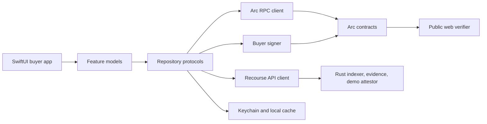

# Recourse iOS Architecture

## 0. Decision

Recourse ships as a native iPhone app first. The buyer experience is built with SwiftUI and Apple system frameworks, distributed through TestFlight and the App Store. Android remains a later client and may use Flutter without changing the contracts, backend, QR format, or API.

This is a buyer protection product, not a general-purpose crypto wallet. The interface leads with protected payments, receipts, evidence, and verdicts. Addresses, gas, and signing remain visible where trust requires them, but wallet mechanics do not lead onboarding.

## 1. Goals and boundaries

The iOS app owns:

- Buyer onboarding and the testnet account experience.
- QR and deep-link checkout.
- Human-readable immutable policy review.
- USDC approval and protected payment transactions.
- Receipt history and onchain payment detail.
- Camera evidence capture and dispute filing.
- Attestation progress, resolution, and verdict presentation.
- Links to the independent web verifier and ArcScan.

The iOS app does not own:

- Merchant or liquidity-provider workflows.
- Policy authoring.
- Verdict computation.
- Evidence attestation.
- A general token browser, swap interface, or multichain wallet.
- Mainnet behavior during the hackathon.

## 2. System position



Authoritative data ownership:

| Data | Authority | App behavior |
|---|---|---|
| USDC balance and allowance | Arc | Read through ERC-20 calls using 6 decimals |
| Policy and policy hash | Arc | Read from PolicyRegistry; API metadata may enrich display |
| Payment state and verdict | Arc | Contract detail is authoritative |
| Payment and dispute lists | Rust indexer | Fast list, then reconcile selected detail with Arc |
| Evidence bytes | Rust evidence store | Upload before filing; submit returned hashes onchain |
| Signing key | Buyer signer | Never enters view state, logs, analytics, or the backend |
| Profile and UI preferences | Device | Persist locally; optional account sync later |

## 3. Architecture style

Use a feature-first modular monolith. Each feature contains its view, observable model, domain state, and repository-facing operations. Shared infrastructure lives in `Core`. Do not add a generic clean-architecture layer for every type.

SwiftUI views remain declarative and side-effect free. `@Observable` models coordinate user actions and expose finite UI state. Repository protocols hide whether data came from Arc, the backend, or local storage. External dependencies stay behind small adapters so the EVM library and wallet implementation can be replaced without rewriting features.

```text
mobile/
  Recourse.xcodeproj
  Recourse/
    App/
      RecourseApp.swift
      AppEnvironment.swift
      AppRouter.swift
      RootView.swift
    Core/
      Chain/
        ArcRPCClient.swift
        ContractGateway.swift
        TransactionMonitor.swift
      API/
        RecourseAPIClient.swift
        APIModels.swift
      Auth/
        BuyerSigner.swift
        TestnetLocalSigner.swift
        KeychainStore.swift
      Config/
        AppConfiguration.swift
        GeneratedAddresses.swift
      DesignSystem/
        Color+Recourse.swift
        Typography.swift
        Components/
      Evidence/
        EvidenceCaptureService.swift
        EvidenceUploadService.swift
      Formatting/
        USDCAmount.swift
        AddressFormatter.swift
      QR/
        PaymentRequest.swift
        PaymentRequestDecoder.swift
      Support/
        AppError.swift
        Loadable.swift
    Features/
      Onboarding/
      Home/
      Scan/
      Checkout/
      Receipts/
      Disputes/
      Verdict/
      Profile/
    Generated/
      Contracts/
      Deployment.swift
    Resources/
      Assets.xcassets
      Config/
  RecourseTests/
  RecourseUITests/
```

## 4. Apple stack

Prefer Apple frameworks before third-party packages:

| Concern | Choice |
|---|---|
| UI | SwiftUI |
| State | Observation with `@Observable` and `@MainActor` feature models |
| Concurrency | async/await, task groups, actors where mutable shared state exists |
| Navigation | `NavigationStack`, typed routes, sheets for scan and evidence capture |
| Networking | `URLSession`, `Codable`, typed endpoint methods |
| QR scanning | AVFoundation metadata capture wrapped in a small UIKit representable |
| Camera evidence | AVFoundation or system camera picker behind `EvidenceCaptureService` |
| Photos | PhotosUI for optional library selection |
| Secrets | Security framework Keychain with user-presence access control |
| Biometrics | LocalAuthentication to unlock signing actions |
| Local cache | Codable files for MVP; SwiftData only when relational offline state is justified |
| Logging | `Logger` from OSLog with privacy annotations |
| Deep links | Universal Links plus `recourse://` fallback for development |

Use Swift Package Manager only. Keep the dependency list deliberately small.

## 5. EVM boundary

Arc is EVM-compatible, but no contract or transaction encoding should leak into SwiftUI features.

```swift
protocol ContractGateway: Sendable {
    func usdcBalance(of address: EthereumAddress) async throws -> USDCAmount
    func allowance(owner: EthereumAddress, spender: EthereumAddress) async throws -> USDCAmount
    func policy(id: UInt64) async throws -> Policy
    func payment(id: UInt64) async throws -> Payment
    func previewVerdict(paymentID: UInt64) async throws -> Verdict
    func approveUSDC(amount: USDCAmount, signer: any BuyerSigner) async throws -> TransactionHash
    func pay(_ request: PaymentRequest, signer: any BuyerSigner) async throws -> TransactionHash
    func fileDispute(_ draft: DisputeDraft, signer: any BuyerSigner) async throws -> TransactionHash
    func resolve(paymentID: UInt64, signer: any BuyerSigner) async throws -> TransactionHash
}
```

Start with `web3swift` behind `ContractGateway` because it provides JSON-RPC, ABI encoding, account creation, transaction signing, receipt polling, and Swift Package Manager support. Pin an exact reviewed version in `Package.resolved`. If its Swift 6 concurrency behavior becomes a problem, only the gateway adapter changes.

Never implement secp256k1, RLP, ABI encoding, or EIP-155 transaction signing inside feature code. Add byte-level fixture tests for every contract call used by the app.

The verdict engine still exists exactly twice: Solidity is canonical and TypeScript is the browser mirror. Swift calls `previewVerdict` through `eth_call` or reads the backend result. Swift never computes refund eligibility.

## 6. Signing and account strategy

Define signing as a replaceable capability:

```swift
protocol BuyerSigner: Sendable {
    var address: EthereumAddress { get async throws }
    func sign(transaction: UnsignedTransaction) async throws -> SignedTransaction
}
```

MVP implementation:

1. Generate a testnet-only Ethereum key on device.
2. Store an encrypted keystore payload in Keychain.
3. Require Face ID, Touch ID, or device passcode before decrypting for a transaction.
4. Keep decrypted key material scoped to the signing operation and clear buffers where the library permits.
5. Never back the key up through iCloud for the prototype.
6. Provide an explicit reset action with a warning that the testnet account will be lost.

Important limitation: Secure Enclave signing uses Apple-supported elliptic curves, not Ethereum's secp256k1. The app must not claim the Ethereum key itself is Secure Enclave-backed. Keychain and biometric access protect the encrypted key material. A production release should replace `TestnetLocalSigner` with a reviewed embedded-wallet, MPC, passkey smart-account, or external-wallet implementation after security and custody review.

Onboarding language should be calm and fintech-like:

- "Create your Recourse account"
- "Your protected payment account is ready"
- "Confirm with Face ID"

Do not start with seed phrases, network selectors, or wallet approvals. An advanced account screen can expose the address, ArcScan link, export policy, and testnet reset controls.

## 7. Navigation and screens

Root navigation uses a three-tab shell:

1. Home: protected balance, active protections, action needed.
2. Scan: prominent central scan action presented as a full-screen flow.
3. Receipts: all protected payments and disputes.

Profile and support open from the Home toolbar rather than consuming a primary tab.

Typed routes:

```swift
enum AppRoute: Hashable {
    case checkout(PaymentRequest)
    case payment(UInt64)
    case dispute(UInt64)
    case verdict(UInt64)
    case account
    case support
}
```

Primary screens:

- Welcome and account creation.
- Testnet funding.
- Home.
- QR scanner.
- Checkout review.
- Transaction progress.
- Payment receipt.
- Receipt list and detail.
- File dispute.
- Evidence review.
- Dispute timeline.
- Verdict.
- Account and security.

## 8. QR and deep-link contract

Payment requests are JSON encoded, then base64url encoded for QR and deep links:

```json
{
  "v": 1,
  "chainId": 5042002,
  "escrow": "0x...",
  "policyId": 3,
  "merchant": "0x...",
  "amount": "25000000",
  "orderRef": "0x..."
}
```

The decoder rejects a request unless:

- `v` is supported.
- `chainId` equals generated testnet configuration.
- `escrow` equals the generated deployment address.
- `amount` is a positive decimal string in 6-decimal USDC base units.
- `orderRef` is exactly 32 bytes.
- The policy exists onchain.
- The policy merchant equals the request merchant.

The merchant web app generates this payload from the same schema. Add Universal Links before TestFlight so camera scans, Safari links, and shared links converge on the same checkout route.

## 9. Core flows and state machines

### 9.1 Protected checkout

```text
scanning
  -> validatingRequest
  -> loadingPolicy
  -> reviewing
  -> checkingAllowance
  -> approving, when required
  -> approvalPending
  -> paying
  -> paymentPending
  -> confirmed
```

Each transaction state includes the hash, ArcScan URL, retry policy, and a safe recovery path after app termination. Persist pending transaction hashes before polling. On relaunch, resume receipt polling and reconcile payment state from Arc.

### 9.2 Dispute

```text
drafting
  -> capturingEvidence
  -> reviewingEvidence
  -> uploadingEvidence
  -> awaitingSignature
  -> filing
  -> transactionPending
  -> pendingAttestation
  -> readyToResolve
  -> resolving
  -> resolved
```

Hash evidence bytes before upload. Compare the backend's returned hash with the locally computed hash before filing. Remove location metadata from photographs unless it is explicitly required evidence. Use background upload only after the foreground path is reliable.

### 9.3 Verdict

The verdict screen reads payment state and calls `previewVerdict`. It shows:

- Refunded, partially refunded, or denied stamp.
- Exact refund percentage and USDC amount.
- Matched rule index or default-policy result.
- Return requirement.
- Onchain verdict hash.
- "Verify independently" web link.

## 10. Repository contracts

```swift
protocol PaymentRepository: Sendable {
    func list(for buyer: EthereumAddress) async throws -> [PaymentSummary]
    func payment(id: UInt64) async throws -> Payment
    func submit(_ request: PaymentRequest) async throws -> PendingTransaction
}

protocol PolicyRepository: Sendable {
    func policy(id: UInt64) async throws -> PolicyPresentation
}

protocol EvidenceRepository: Sendable {
    func upload(_ evidence: CapturedEvidence) async throws -> UploadedEvidence
}
```

List screens read the backend for speed and support pull-to-refresh. Detail and transaction screens reconcile against Arc. If the backend is unavailable, display an honest sync warning and use chain-direct detail where possible. Never substitute mock records in a live build.

## 11. Configuration and code generation

`deployments/arc-testnet.json` remains the sole address source. Extend `ops/codegen.mjs` to emit:

```text
mobile/Recourse/Generated/Deployment.swift
mobile/Recourse/Generated/Contracts/*.swift or ABI JSON resources
```

Build configurations:

| Configuration | Backend | Chain | Distribution |
|---|---|---|---|
| Debug | Local or shared test API | Arc Testnet | Developer |
| TestFlight | Hosted test API | Arc Testnet | Internal and external testing |
| Release | Production API later | Mainnet only after audit and approval | App Store |

Use `.xcconfig` files for non-secret endpoints and bundle identifiers. RPC keys and backend credentials must not be treated as secrets inside the app bundle. No private signing keys or attestor credentials enter Xcode configuration.

## 12. Security and privacy

- Testnet only until the contracts and custody model are reviewed.
- Face ID or device passcode gates signing, not ordinary read access.
- Key material never enters analytics, crash reports, screenshots, clipboard, or logs.
- OSLog values containing addresses, transaction hashes, and order references use private privacy annotations by default.
- Evidence uploads use TLS, content-size limits, MIME validation, and local hash verification.
- Camera permission is requested only when the user scans or captures evidence.
- Photo-library permission is optional and scoped through PhotosUI.
- Sensitive screens opt out of app-switcher snapshots where appropriate.
- Accessibility labels, Dynamic Type, reduced motion, and sufficient contrast are release requirements.
- Dependency versions are pinned and reviewed before each release.

App Store distribution and Apple Developer Enterprise Program distribution are different release paths. The first target is TestFlight and the App Store. Enterprise distribution is considered only for eligible internal organizational deployment.

## 13. Testing strategy

Unit tests:

- QR parser acceptance and adversarial rejection cases.
- USDC 6-decimal parsing and formatting.
- Checkout and dispute state transitions.
- Contract ABI request encoding and response decoding fixtures.
- Repository backend-to-chain reconciliation.
- Evidence hashing and metadata removal.

UI and snapshot tests:

- Onboarding.
- Checkout policy card.
- Approval and payment progress.
- Receipt detail.
- Evidence review.
- Refunded, denied, and partial verdict states.
- Dynamic Type, dark mode if supported, and common iPhone sizes.

Integration tests:

- Local Anvil approve, pay, dispute, attest, resolve, and receipt flow.
- Stubbed API failures and delayed indexer synchronization.
- App termination during a pending transaction, followed by successful recovery.
- One logged Arc Testnet rehearsal before the demo.

No Swift test should reproduce policy matching rules. Tests assert that `previewVerdict` is called and decoded correctly.

## 14. Delivery phases

### M4.1 Foundation

- Xcode project, SwiftUI design system, environment injection, typed router.
- Generated deployment configuration and contract gateway.
- Testnet local signer with Keychain and biometric confirmation.

### M4.2 Pay

- QR scanner and decoder.
- Onchain policy review.
- USDC allowance, approval, payment, receipt polling, recovery.

### M4.3 Receipts

- Buyer-filtered API list.
- Chain-reconciled detail and protection status.
- ArcScan and web-verifier links.

### M4.4 Disputes

- Camera evidence, metadata cleanup, hash, upload.
- File-dispute transaction and attestation timeline.

### M4.5 Verdict and polish

- Resolve flow and verdict presentation.
- Accessibility, haptics, motion, snapshots, and TestFlight build.

## 15. Required server and web work

Before the complete app flow can be live:

1. Add `buyer` filtering to `GET /api/payments`.
2. Build `POST /api/evidence` and evidence retrieval.
3. Add merchant QR generation using the versioned payment-request schema.
4. Decide whether the demo app calls permissionless `resolve` directly or asks the demo backend to resolve.
5. Provide a safe Arc Testnet gas and ERC-20 USDC funding path for newly created buyer accounts.
6. Extend address and ABI code generation for Swift.

## 16. Android compatibility seam

Android can later be built in Flutter without sharing UI code. Compatibility comes from stable boundaries:

- Versioned QR and Universal Link payloads.
- OpenAPI-documented backend contracts.
- Generated deployment addresses and ABIs.
- Chain-authoritative payment semantics.
- The same product state machines and copy vocabulary.

The iPhone app should not wait for a cross-platform abstraction. It should make these external contracts precise enough that a later Android client can implement them independently.

